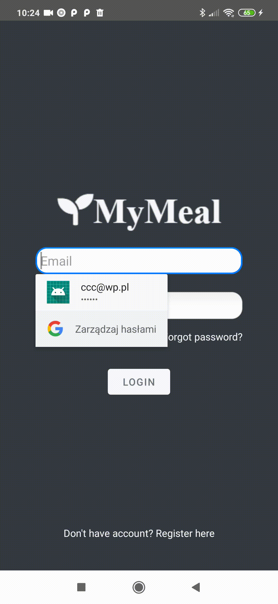
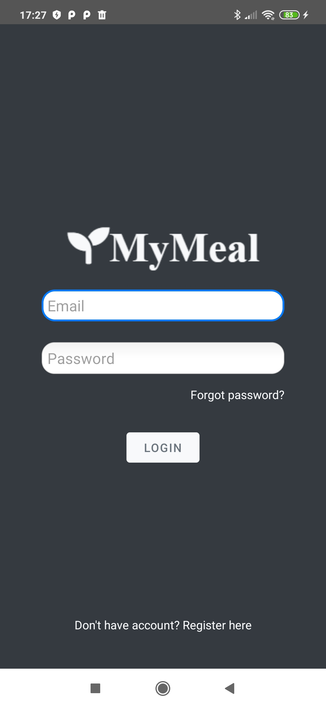
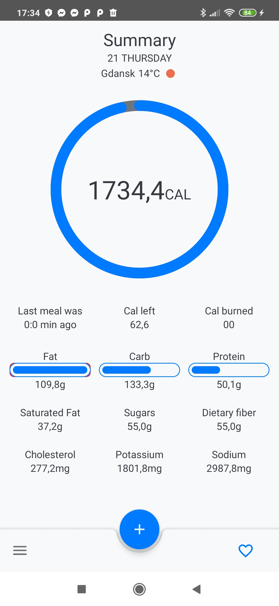
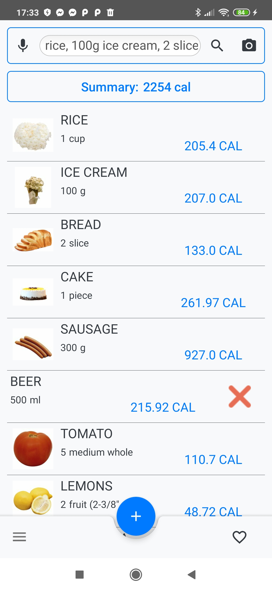
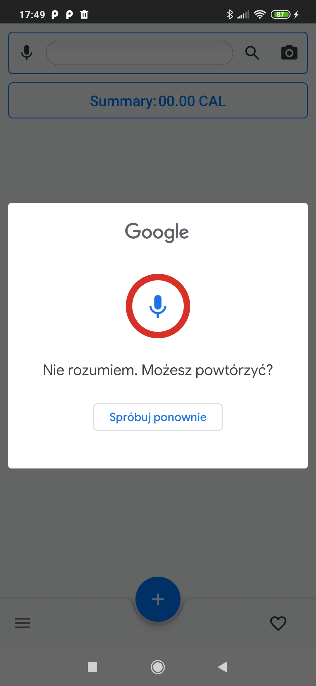
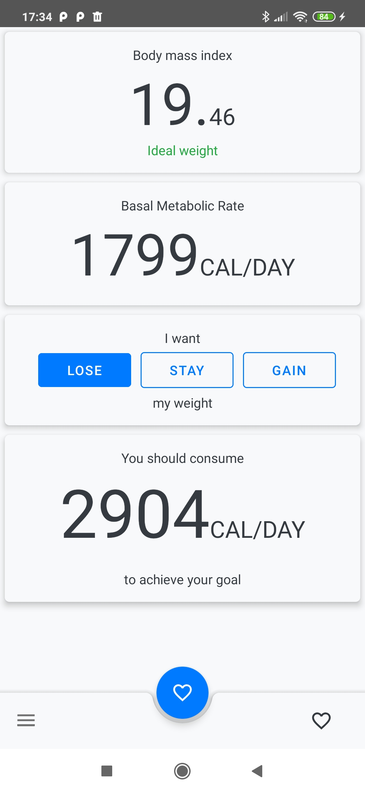
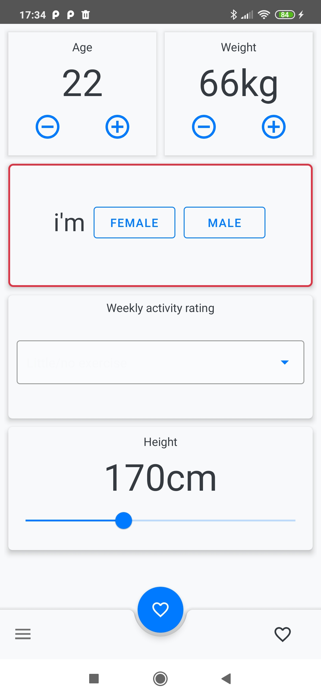

# MyMeal
> This is a health application witch can help users easly calculate daily calories demand and assist all day with decision what user should
or what should not eat. 

## Table of contents
* [General info](#general-info)
* [Screenshots](#screenshots)
* [Technologies](#technologies)
* [Setup](#setup)
* [Features](#features)
* [Status](#status)
* [Contact](#contact)
* [Credentials](#credentials)


## General info
This project was motivated by creating app witch help can I control what i eat and how often do i eat snack. I created simple to read and use user interface to save time. User after first login into this app should calculate his BMR level. When it is done this app can calculate all nutriens and calories daily demand. With simple search, all foods can be check before consume and easli add to consumed list. Simple main UI can be easly readed and with thats prezent fact user can decide what should he eat or what should not. Application is based on user accounts witch is created and administrated on Firebase cloud platform where also is stored user data. 

## Screenshots
<p align="center">
 
 
 
</p>


1. Login:
<p align="center">
 
</p>
2. Main view:
<p align="center">

</p>
3. Search for foods:
<p align="center">

</p>
4. Search food with voice recognition: 
<p align="center">

</p>
5. BMR calculator: 
<p align="center">


</p>


## Technologies
* Android Studio 
* Java8
* REST with okhhtp3 library 
* Firebase Auth
* Firebase - realtime database
* MaterialDesign

## Setup
1. Firebase:
 *Create and configure Firebase Auth and realtime database
 *Add application to Firebase project
 *Download google-service.json and put it into project
2. Nutrition
 *Create account
 *Generate API keys
3. Current weather 
 *Create account
 *Generate API keys
4. Application
 *Create new file apikeys.xml in values
 *Copy paste code below and insert yours data
 
```xml

<?xml version="1.0" encoding="utf-8"?>
<resources>
   <!-- NUTRITIONIX API -->
   <string name="x_app_id">APP_ID</string>
   <string name="x_app_key">API_KEY</string>
   <string name="x_remote_user_id">USER</string>
   <string name="timezone">US/Eastern</string>

   <!-- WEATHER API / SERVICE  -->
   <string name="APPID">API_KEY</string>
   <string name="period_weather_api_call_in_seconds">REFRESH</string>
</resources>
```

5. Voilà its is working :)

## Features
* Calculate BMR
* Presents daily consume nutrients and calories
* Check any food nutrients
* Voice input
* Current weather in yours location


What can be improved:
* Bar code scanning
* Add notifications
* Add diet creator

## Status
Not longer continued, because it was created without any framework. Now  I wont to focus on learning new awesome form of write apps with those freamewworks.

## Credentials
>https://openweathermap.org/ - Current weather </br>
>https://www.nutritionix.com/ - Nutrition facts </br>
>https://github.com/hdodenhof/CircleImageView - Circle image </br>
>https://github.com/square/picasso - Image downloader </br>
>https://github.com/baoyongzhang/SwipeMenuListView - Swipe menu list </br>
>https://github.com/lopspower/CircularProgressBar - Circular progress bar </br>

## Contact
Feel free to contact Adrian Wozniak (adrianwozniak576@gmail.com)

